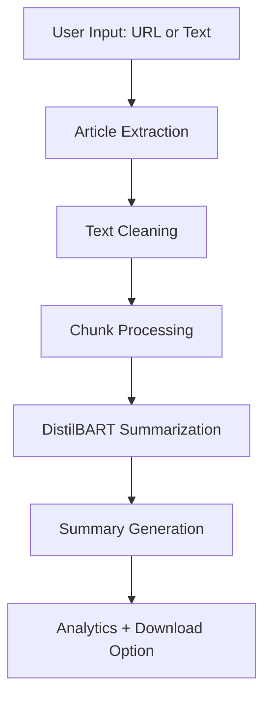

# 📰 AI News Summarizer


A modern, AI-powered web application that automatically summarizes long news articles using Hugging Face Transformers and Streamlit. Built with performance optimization and simplicity in mind, the app uses efficient chunk processing and optimized PyTorch inference for fast, real-time summarization.

🔗 **[Live Demo](https://news-summarizer-7g8fnozeszmvp49iscdm7w.streamlit.app/)** | 🐙 **[GitHub Repository](https://github.com/witharyank/news-summarizer)**

---

##  Features

- ** AI-Powered Summarization:** Uses the pretrained `sshleifer/distilbart-cnn-12-6` model for high-quality abstractive summarization.
- ** Intelligent URL Scraping:** Automatically fetches the article, extracts the core content (filtering out ads/boilerplates), and parses webpage title/domain metadata.
- ** Direct Text Summarization:** Instantly summarize pasted text from blogs, research papers, or documentation.
- ** Configurable Settings:** Choose between Short, Medium, or Long summaries in **Paragraph** or **Bullet Points** format.
- ** Sentiment Analysis:** Enable optional sentiment tone classification powered by a cached DistilBERT model.
- ** Topic Keywords:** Automatically extracts and displays top keywords as interactive styled badges.
- ** Recent Summaries (History):** Sidebar panel remembers the last 5 summarized articles during the session.
- ** Rich Analytics:** Custom progress bars showing compression ratios, time saved, word counts, and language check badges.
- ** One-Click Export:** Easily download summaries as `.txt` files or copy them with a single click.
- ** Glassmorphic Dark UI:** Responsive interface with custom CSS styling, linear gradients, card layouts, and subtle transitions.

---

##  Tech Stack

| Component | Technology |
|---|---|
| **Frontend** | Streamlit |
| **Language** | Python |
| **NLP Framework** | Hugging Face Transformers |
| **Backend** | PyTorch |
| **Web Scraping** | BeautifulSoup4, Requests |
| **Model** | DistilBART CNN-12-6 |

---

## Installation & Setup

1. **Clone the Repository**
   ```bash
   git clone https://github.com/witharyank/news-summarizer.git
   cd news-summarizer
   ```

2. **Create a Virtual Environment**

   *Windows:*
   ```bash
   python -m venv .venv
   .venv\Scripts\activate
   ```

   *macOS/Linux:*
   ```bash
   python3 -m venv .venv
   source .venv/bin/activate
   ```

3. **Install Dependencies**
   ```bash
   pip install -r requirements.txt
   ```

4. **Run the Application**
   ```bash
   streamlit run news_summarizer_app.py
   ```

---

## Application Workflow



---

## Example Use Cases

-  News article summarization
-  Research paper overviews
-  Blog summarization
-  Corporate news digests
-  Student study assistance
-  Quick content understanding

---

## Future Improvements

- Multi-language summarization
- PDF support
- Bullet-point summaries
- Light/Dark theme toggle
- Advanced transformer models
- Docker deployment
- Text-to-speech summaries
- Summary quality scoring

---

## Author

**Kumar Aryan**  
Computer Science Undergraduate interested in Artificial Intelligence, NLP Applications, Cloud Computing, and Full Stack Development.

-  **GitHub:** [@witharyank](https://github.com/witharyank)

---

## Support the Project

If you like this project, please consider:
-  Starring the repository
-  Forking the project
-  Contributing improvements
-  Sharing with others

## License

This project is open-source and available under the **MIT License**.

---
*Built with ❤️ using Python, Streamlit, Hugging Face Transformers, and PyTorch.*
